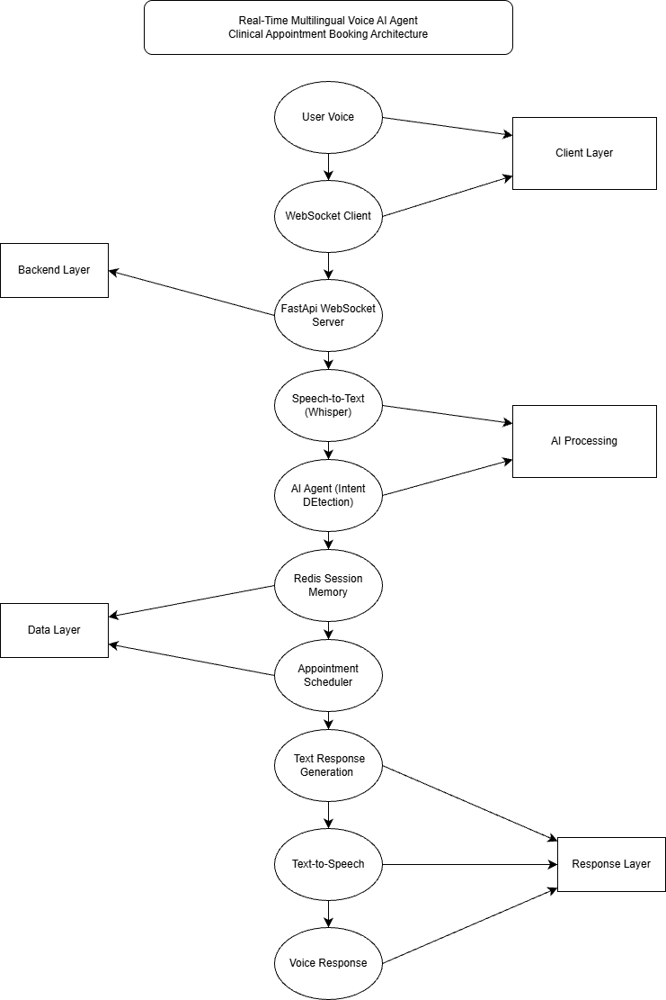

# Real-Time Multilingual Voice AI Agent

A real-time voice-based AI system that allows patients to book, reschedule, and cancel clinical appointments using natural voice conversations.

The system converts speech into text using Whisper, interprets the request using an AI agent, interacts with the appointment scheduler, and responds back using text-to-speech.

## System Architecture

The system follows a real-time conversational pipeline.

Voice input from the user is processed using speech recognition, interpreted by an AI agent, and connected to a scheduling service that manages clinical appointments.
The system then generates a spoken response using text-to-speech.

### Architecture Diagram




## Technology Stack

The system is built using the following technologies:

* **Python** – Core programming language used for the backend system
* **FastAPI** – Backend framework used to build the API and WebSocket server
* **WebSockets** – Enables real-time communication between the client and the server
* **Whisper** – Speech-to-text model used to convert voice input into text
* **Redis** – Used for storing session memory and conversation context
* **Text-to-Speech Engine** – Converts the system response into audio
* **Appointment Scheduling Engine** – Handles booking and availability logic


## System Pipeline

The system processes a user's voice request through several stages.

1. **User Voice Input**
   The user speaks a request such as:
   "Book appointment with cardiologist tomorrow."

2. **Speech-to-Text**
   The Whisper model converts the audio into text.

3. **AI Agent Reasoning**
   The AI agent interprets the user request and extracts the intent, doctor type, and date.

4. **Session Memory**
   Redis stores session data and conversation context.

5. **Appointment Scheduling**
   The system checks doctor availability and books the appointment.

6. **Response Generation**
   A confirmation message is generated.

7. **Text-to-Speech**
   The confirmation message is converted into audio and returned to the user.

## Latency Measurement

The system measures latency for each stage of the voice processing pipeline.

| Stage                        | Latency       |
| ---------------------------- | ------------- |
| Speech Recognition (Whisper) | ~1.28 seconds |
| Agent Reasoning              | ~0 seconds    |
| Text-to-Speech               | ~0.45 seconds |
| Total System Latency         | ~1.74 seconds |

Speech recognition latency is higher because the Whisper model is running on CPU.
Using GPU acceleration would significantly reduce the processing time.


## Setup Instructions

### 1. Clone the Repository

Clone the project from GitHub and navigate to the project folder.

```
git clone <repository-url>
cd voice-ai-agent
```

### 2. Create a Virtual Environment

Create and activate a Python virtual environment.

```
python -m venv venv
venv\Scripts\activate
```

### 3. Install Dependencies

Install the required Python packages.

```
pip install -r requirements.txt
```

### 4. Run the Server

Start the FastAPI WebSocket server.

```
uvicorn backend.main:app --reload
```

The server will run at:

```
http://127.0.0.1:8000
```

### 5. Test the Voice Pipeline

Run the WebSocket test client to simulate a voice request.

```
python test_ws.py
```

The system will process the audio request, book the appointment, and return a spoken response.
